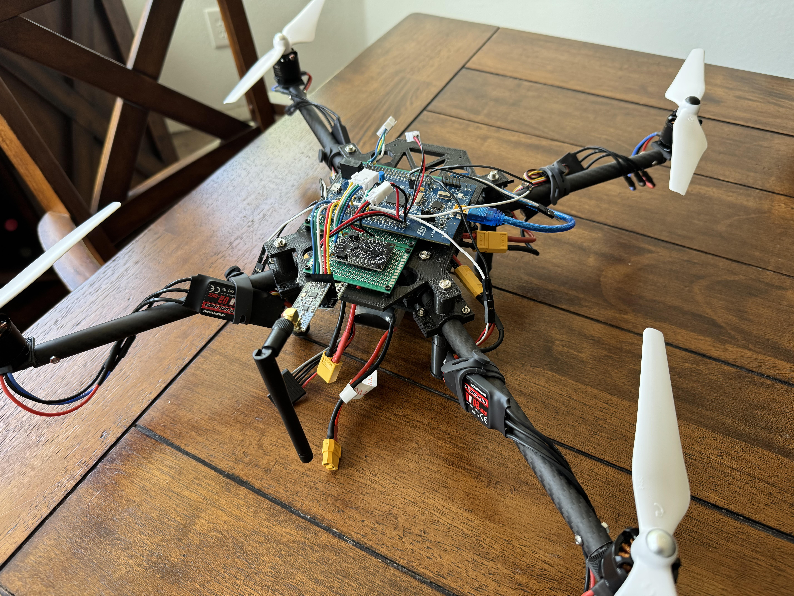

# Bare-Metal Embedded-C Drone & Flight Controller

<!--  -->
<figure>
    
    <figcaption>It may be a rats nest of wires, but it's MY rats nest of wires.</figcaption>
</figure>

## Table of Contents

- [Description](#description)
- [Requirements](#requirements)
- [Flashing](#flashing-the-board)
- [Used Components](#external-components)
- [Peripheral Settings](#current-peripheral-settings)
- [Filter Methods](#madgwick-filter)

 

## Description

This repo is mainly for practicing bare-metal embedded C programming on the STM32F407G-DISC1 board and following the book: Bare-Metal Embedded C Programming by Israel Gbati.

I'm just trying to learn as much as I can. Along that note, this repo does not use any CMSIS files or HAL libraries from STM; I figured doing so would help me learn more about how everything works even it's not the most performant.

 

## Requirements
* GNU ARM Embedded Toolchain
* OpenOCD
* GCC for Windows or Linux
* Python 3.X

 

## Flashing the Board
1. cd into the root folder of this project
2. Run the build.sh bash script to build the whole project.
    
    `./make.sh`

3. Run the flash.sh bash script to flash the compiled ELF file to the board. Make sure the board is plugged in to flash.

    `./flash.sh`

4. If you want to read the USART output from the device
   1. Make sure the USART-to-USB board is wired and plugged in
   2. Launch a serial USB port reading application in another terminal

 

#### Special Instructions for Flashing on Windows
* If trying to compile on WSL, you must do the following steps so that the board is able to be seen by openOCD
  1. Launch a PowerShell window in admin mode
  2. Run the following line: `usbipd list`
  3. Note the ID of the board from the list
  4. Run the following line inserting the ID: `usbipd attach --busid <BUSID> --wsl`

 

## External Components

### BerryIMU v3 10-DOF IMU

##### Links

| [Overview](https://ozzmaker.com/product/berryimu-accelerometer-gyroscope-magnetometer-barometricaltitude-sensor/) | [Pinout](https://ozzmaker.com/wp-content/uploads/2020/08/BerryIMUv3Raspberry.png) | [SPI Setup](https://ozzmaker.com/connecting-berryimuv3-via-spi-to-a-raspberry-pi/)

| [LSM6DSL](https://ozzmaker.com/wp-content/uploads/2020/08/lsm6dsl-datasheet.pdf) | [LIS3MDL](https://ozzmaker.com/wp-content/uploads/2020/08/lis3mdl.pdf) | [BM388](https://ozzmaker.com/wp-content/uploads/2020/02/BMP388-ds001.pdf) |

##### Description

This board is an Inertial Measurement Unit (IMU) which incorporates an accelerometer, gyroscope, magnetometer, barometer, and temperature sensor all on the same board. Typically, these combination of sensors are used in conjection to calculate the orientation of the board in 3D space, but it can also be used for general tilt sensing, pedometers, tap sensing, etc. This project will use this board to estimate the 3D orientation of the quadcopter in real-time.

##### Configuration

###### Accelerometer (LSM6DSL)

The accelerometer is configured to have an Ouput Data Rate (ODR) of 3.3kHz with low and high pass filters of ODR/9. It's only on $\pm 4g$ sensitivity as I don't expect my applicaiton to be going very fast. Lastly, I set the Block Data Update bit for control register 3 which blocks continuous updates until the MSB and LSB have been read.

Note: are these the best settings? No, but they work fine for right now.

###### Gyroscope (LSM6DSL)

The gyroscope is configured to also have an ODR of 3.3kHz with it's sensitvity at 500 dps (degrees per second). Again, this drone probably isn't moving very fast so high sensitivity would only lead to more noise in the system. This sensor is also configured to have a high and low pass filter.

Note: are these the best settings? No, but they work fine for right now.

###### Magnetometer (LIS3MDL)

This sensor was not used at the time of writing, because frankly I couldn't get the master I2C to work on LSM6DSL to talk to the LIS3MDL (magnetometer) sensor via SPI. Hopeuflly this gets figured out eventually!

###### Pressure (BMP388)

This sensor was not used at the time of writing, because frankly I couldn't get the master I2C to work on LSM6DSL to talk to the BMP388 (barometer) sensor via SPI. Hopeuflly this gets figured out eventually!

---

### Electronic Speed Controller (ESC) - [Link](https://www.hobbywingdirect.com/products/skywalker-esc-30a?srsltid=AfmBOoo4jPsj8Cw2gNXTsvY-Jg083MuQC2i5FRH6rTTn0dHf2sIzp6eH)

##### Description

This ESC is a simple, entry-level motor controller, but has been over spec-ed to account for any voltage spikes that could occur. These ESC's also come with two leads for and extra BEC line and a programming line. The BEC line supports up to 5V 5A and will hopefully be used to power some LED's on the arms of the quadcopter. The signal line is being controlled via a PWM pin on the MCU, with the duty cycle varying between ~1ms to ~2ms with an update rate of ~400 Hz. The duty cycle vaies between these values because the ESC is built to comply with Futaba's Standard of 1100 and 1940 microseconds. Futaba's Standard is pretty common for hobby level flying creations like drones, planes, and single-rotors, and is far simpler (but slower) than another form of communication like D-Shot. The pins used to provide PWM to the four ESC's were PC6, PC7, PC8, PC9.

---

### Motor - SunnySky X2212 980KV - [Link](https://sunnyskyusa.com/products/sunnysky-x2212-brushless-motors-new?srsltid=AfmBOooHTCWo2V5ESi72pRGVuCphP4LgCLehmAm6OVzSersa_RpPchxA)

##### Description

This motor is a small, entry-level, torque focused motor. A 980 KV is more tuned to be a "heavy lifting" motor because it has a lower KV; a lower KV translates to a lower max RPM with the following equation of operating voltage * KV: 14.8 (V) * 980 (RPM/V) = 14,504 RPM. This drone build was not designed to be a racing drone, but something more stable just for show and experimentation. Two Cloackwise (CW) and Counterclockwise (CCW) motors were chosen for this build with a blades out configuration. It's possible to just buy all the same CW or CCW motor and swap the set of power leads to two of the motors (to spin in reverse), but I didn't want do that and just wanted to wire things normally. The motos also make a continuous beeping noise when they aren't convifugred with a stable PWM source, but when one is provided they make a short tune to say they are configured correctly. More physical and electrical motor specifications can be found at the link above.

---

### RF Transceiver - NRF24L01+PA+LNA - [Link](https://www.amazon.com/gp/product/B07ZGQ2X7Q/ref=ox_sc_act_title_2?smid=A1VTL661FOEJB1&psc=1)

##### Description

This is a small radio module that operates in the 2.4 GHz range. This project will be using two of these; one for the ground station and one for the drone. Please make sure that you check out your regions radio frequency spectrum laws so that you aren't transmitting at a frequency you shouldn't be. For the US, the 2.4-2.4835 GHz range is a license-free Industrial, Scientific, and Medical (ISM) radio band.

This board is equipt with a Power Amplifier (PA) and Low Noise Amplifier (LNA) which are used to increase signal strength and reduce accumulated interference, reqpectively; these two features mainly extend the effective range of the board which is listed at about ~1 km. It's also rated to support 250kbps-2Mbps data rates depending on configuration. This model also has 125 channels which supports mesh networks of these modules.

---

### Battery Pack - [Link](https://genstattu.com/tattu-2300mah-4s-75c-lipo-battery-pack-with-xt60-plug/?srsltid=AfmBOorbmZlas45tGu5uICt_1vnR04mdFqh8_4CqffeuCL02hHuqwY0q)

##### Description

This is a 4S or 4 cell battery with a voltage of 14.8V and 2300mAh capacity. It's not the biggest battery that I could put on this drone, but it's good enough for testing purposes.

---

### Power Distribution Board - [Link](https://speedyfpv.com/products/drone-power-distribution-board-xt60-3-4s-9-18v-5v-12v-output-pdb?variant=8596736049203)

##### Description

This board does as the name suggests: it distributes the power to all the connected components. It takes in the power of the battery, and safely sends it out to the flight controller, ESC's/motors, and anything else. The board has the capability to support up to six motors, but this build will only be using four; note that the maximum amperage rated for six motor use is less than that of four motor use.

---

## Current Peripheral Settings

### General Notes

* Uses base clock of 16 MHz for CPU and all buses
* The NVIC table is written in the general ARM Cortex-M4 chip, and is not tailored for this specific chip
  * Therefore, extra care was taken to only use the interrupts this chip has

### Timers

#### TIM2

This timer is used as the update frequency for the IMU, Madgwick filter, updating the PWM's for all the motors. It was set at 250Hz which seemed like a fine rate to be accurately checking the IMU, calculating quaternions, and updating motor speeds.

It also has an interrupt triggered on its overflow such that it sets a global flag indicating to the Main loop that everything is ready to read and updated. This interrupt also triggers another 1 second flag that was only for debugging purposes like received packets per second and other update rates.

#### TIM5

This timer is used as general 1ms timer for waiting/sleeping purposes. Mainly used when initializing things.

#### TIM6

This timer is used as general 1us (microsecond) timer for waiting/sleeping purposes. Mainly used when transmitting messages on the NRF24L01 transceiver.

#### TIM8

This timer is used for the PWM output for the ESC's/motors. It uses it's 4 channels on pins PC6, PC7, PC8, PC9 to change the PWM for each motor simultaneously. This timer updates at a rate of 400 Hz for faster throttle changes/response. The fastest this timer may go is 500Hz as the schema to control the ESC's/motors does not allow a period faster than that.

### LED's

#### Green, Blue, Red, and Orange

All of these LED's are initialized and are typically used to show success/failure modes. There may be combinations of these LED's in the future, but right now they operate individually.

* Green: Success of initializing all peripherals, and then a blink showing the updating of the complimentary filter
* Blue: To show a BusFault has happened
* Red: To show a HardFault has happened
* Orange: To show a UsageFault has happened

### USART

#### USART2

This peripheral uses GPIO pins PA2 & PA3 in alternate function mode to enable basic USART communication to my development machine. I have configured the protocol to operate at 115200 baud, but may change in the future depending on frequency of messaging; this peripheral will be toggled off in the final deployment of the code as a computer will not be connected to it at all times. Therefore, USART is mainly used for debugging.

### SPI

#### SPI1 & SPI2

These peripherals uses GPIO pins PB3, PB4, PB5, and PB7 for SPI1 and PB12, PB13, PB14, and PB15 for SPI2. These busses are used to communicate to both IMU modules. If other devices need to communicate via SPI1 (and at the same frequency), then they will share the SDO (MISO), SDI (MOSI), and SCL (SCK) pins as the IMU module, but will need another GPIO pin for the CS of the new device. SPI1 & SPI2 is setup to operate at 1MHz, reduced from the 16MHz bus frequency; this was done to limit extra noise on the sensor.

#### SPI3

This peripheral uses GPIO pins PC10, PC11, PC12, PD3, and PD4. This bus is used to communicate to the RF module (NRF24L01+); pins PD3 and PD4 are setup to be the CE and CSN pins which are used to turn the radio ON/OFF for use as well as for following the SPI communication protocol. SPI3 is setup to operate at 1MHz, reduced from the 16MHz bus frequency; this was done to limit extra noise on the sensor.

## Madgwick Filter

This was NOT an original idea, and I encourage anyone to read into it further as I probably will not be able to fully articulate the ability of this filter and orientation estimator. High-level, the Madgwick filter is a process that uses quaternions to represent the orienation of something in 3D space. I also can't give a great explanation of quaternions here, but essentailly they are 4D vectors with one real part and three imaginary parts; this allows quaternions to efficiently be converted to Euler angles (or any other schema) but without the problem of gimbal lock.

Anyway, the Madgwcik filter uses quaternions and fast gradient-descent to find the orientation of the object through all the sensor noise and drift associated with gyroscopes. There are two versions of the Madgwick filter, one that just uses Accelerometer and Gyroscope sensors, and one that is MARG (Magnetic, Angular Rate, and Gravity). The filter boasts great resolution even at update speeds of 10Hz as well as computational efficiency for applicaitons with limited resources (like this one!).

I'm not going to try explaining the math behind this great filter, so I implore you to read it yourself. There are many other implementations of this filter online/github, but I went with the following site because everything was open-source!

| [Paper Link](https://x-io.co.uk/downloads/madgwick_internal_report.pdf) |  [Code Link](https://x-io.co.uk/open-source-imu-and-ahrs-algorithms/) |

 

 
